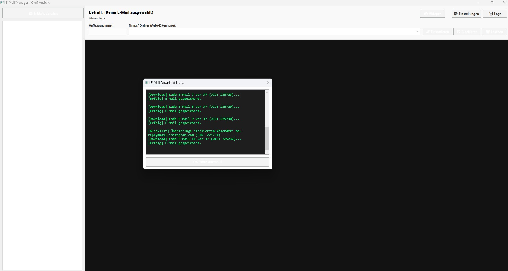
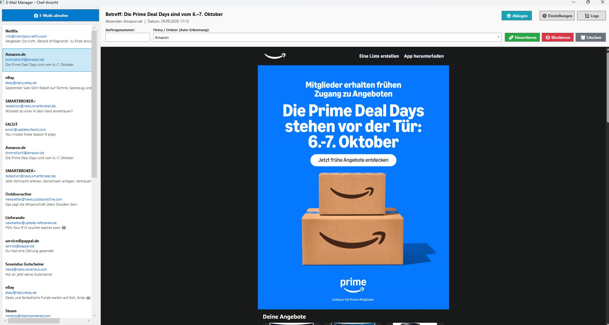

# 📧 E-Mail Downloader & Sortier-Tool

Ein Windows-Desktop-Tool zum automatischen Abrufen von E-Mails per IMAP, das eingehende Nachrichten übersichtlich sammelt und dir hilft, sie schnell in Firmenordner einzusortieren, zu archivieren, zu löschen oder blockierte Absender fernzuhalten.

Gedacht für den täglichen Einsatz in kleinen Büros oder bei Selbstständigen, die E-Mails mit Anhängen (z. B. Aufträge, Rechnungen) manuell nach Kunde/Firma sortieren müssen, ohne im normalen Mail-Client zu arbeiten.

---

## ✨ Funktionen

- **IMAP-Abruf** über [MailKit](https://github.com/jstedfast/MailKit), inklusive Anhängen und HTML-Vorschau (Bilder werden automatisch eingebettet)
- **Übersichtliche Chef-Ansicht** (WPF) mit E-Mail-Liste, Vorschau per WebView2 und Anhangs-Kacheln
- **Vier Wege, eine E-Mail zu bearbeiten:**
  - 🚀 **Einsortieren** – verschiebt die Mail samt Anhängen in einen Firmenordner, benannt nach Auftragsnummer + Firma
  - 📦 **Ablegen** – verschiebt die Mail in einen frei wählbaren Archiv-Ordner (für Mails, die man weder zuordnen noch löschen will), benannt nach Absender + Hash
  - 🚫 **Blockieren** – setzt den Absender auf eine dauerhafte Blacklist, künftige Mails werden beim Abruf automatisch übersprungen
  - 🗑️ **Löschen** – entfernt die Mail unwiderruflich
- **Automatische Firmenerkennung**: Merkt sich pro Absender, welcher Firma er zuletzt zugeordnet wurde, und schlägt das beim nächsten Mal automatisch vor
- **SQLite-Datenbank** für Regeln (Blacklist, Firmenzuordnung) und die Liste unsortierter Mails
- **Einstellungen direkt in der App** (Ordnerpfade, IMAP-Zugangsdaten, Abrufzeitraum, Delay, nur ungelesene Mails)
- **Logging** über [Serilog](https://serilog.net/), einsehbar direkt in der Anwendung
- Zusätzlich eine schlanke **Konsolen-Variante** für den Abruf ohne GUI (z. B. für geplante Tasks)

---

## 🖼️ Vorschau

--- 

## 🚀 Nutzung

1. Auf **📥 E-Mails abrufen** klicken – neue Mails landen im Unsorted-Ordner und erscheinen in der Liste
2. Eine E-Mail auswählen, um Vorschau, Absender und Anhänge zu sehen
3. Entscheiden:
   - **Einsortieren**: Auftragsnummer + Firma eintragen und bestätigen
   - **Ablegen**: Mail wandert unverändert ins Archiv (mit Sicherheitsabfrage)
   - **Blockieren**: Absender landet auf der Blacklist, Mail wird entfernt
   - **Löschen**: Mail wird unwiderruflich gelöscht
4. Blockierte Absender lassen sich jederzeit in den Einstellungen unter **🚫 Blockierte Absender** wieder entsperren

---
